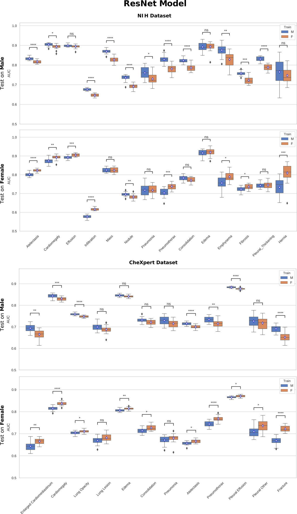

# GenderBias_CheXNet
In this tutorial you will find all the steps and instructions you need in order to reproduce the experiments performed in "Diversity Matters: Gender Imbalance in Medical Imaging Datasets Produces Biased Classifiers for Computer-aided Diagnosis" by Agostina Larrazabal, Nicolás Nieto, Victoria Peterson, Diego H. Milone, and Enzo Ferrante. October 2019.

This code is based on the following publicly available implementation of CheXNet using Keras: https://github.com/brucechou1983/CheXNet-Keras

### Step 0: If it is your first time coding in Python 3, you will have to install it. We recommend to install Anaconda Distribution:

You could find some straigthforward instructions in the following tutorial (up to Step 8):

https://www.digitalocean.com/community/tutorials/how-to-install-anaconda-on-ubuntu-18-04-quickstart

We use conda 4.7.12

### Step 1 - Download the GenderBias_CheXNet repository:

In this repository you will find all the scripts needed to repoduce our experiments.

### Step 2 - Download the X-ray images (If you already have the dataset skip this step):

- Open a Terminal

- Set the terminal path in the unzip GenderBias_CheXNet

(base)>> `python batch_download_zips.py`

This may take a while. 

If you rather prefer to download the data by your own, you could find all the files here:

https://nihcc.app.box.com/v/ChestXray-NIHCC/folder/37178474737

### Step 3 - Create a Python enviroment:

  1- Open a Terminal in the repository's path.
  
  2- Run the following command:
 
  (base)>>`conda env create --name your_env_name  --file requirements.txt`
  
Some packages could not be install by conda so we have to install theme with pip inside your environmiroment.

  (base)>>`source activate your_env_name`
  
  (your_env_name)>> `pip install pillow==4.2.0`
  
  (your_env_name)>> `pip install opencv-python==4.1.0.25`
  
  (your_env_name)>> `pip install imgaug==0.2.9`
  
### Step 4 - Check CUDA version compatibility:

  Check your system cuda version
  
  (your_env_name)>> `nvcc --version`
  
  Update your env cuda version
  
  (your_env_name)>> `conda install cudatoolkit==your_cuda_version`
 
### Step 5 - Activate the environment with the following command:

  (base)>>`source activate your_env_name`
  
  You will see your environment name in the command line
  
  (your_env_name)>>
  
### Step 6 - Training the network:

First, make sure that in "config_file.ini" the image_source_dir contains the path where you have download the dataset.

Run the training script with the following command:

(yout_env_name)>> `python3 training.py`

When the training process finished, you will find the "/output" folder that contains the trained weights of the network.

### Step 7 - Testing the network:

Now that you have your model trained, it is time to generate predictions in unseen data

Run the testing script with the following command:

  (your_env_name)>>`python3 testing.py`
  
When the testing is over, you will find the network predictions in the "/output" folder. 

As an example, for the fold 0, training with only male images and testing on female set you will find:

`y_pred_run_0_train_0%_female_images_test_female.csv`

### Results

